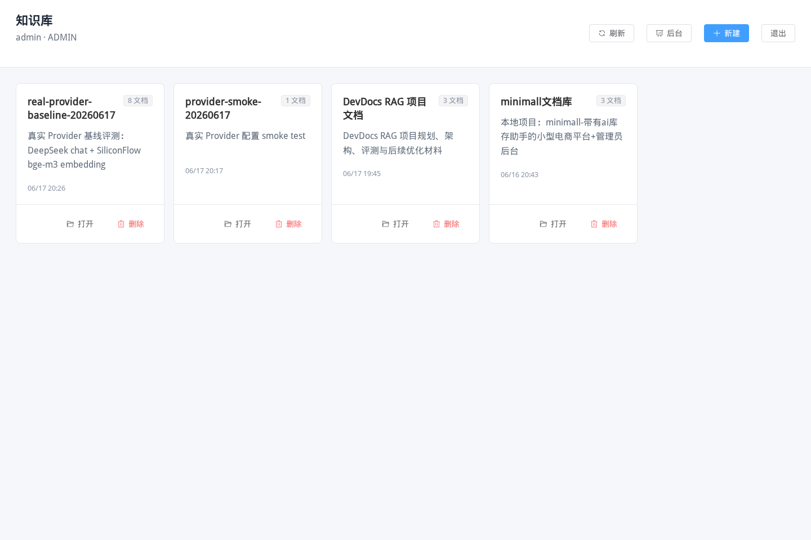
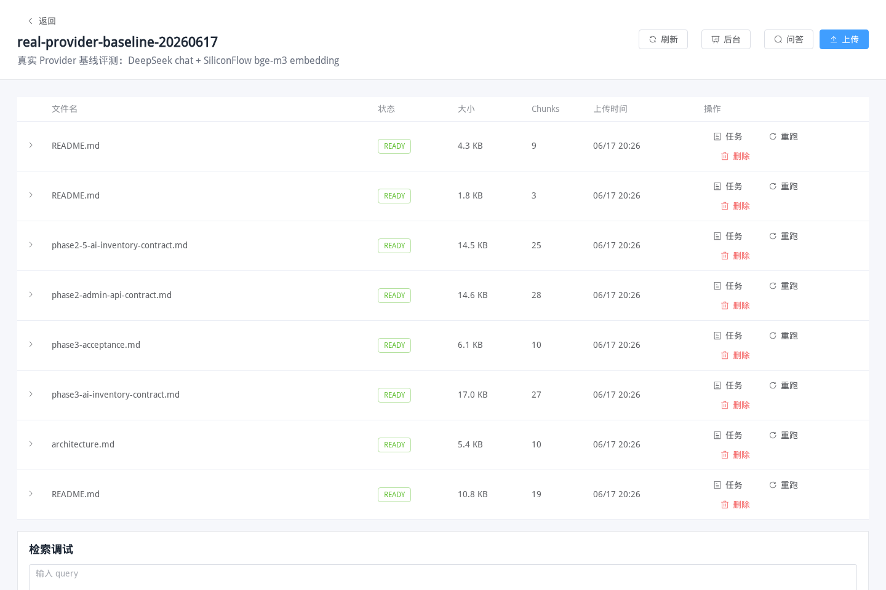
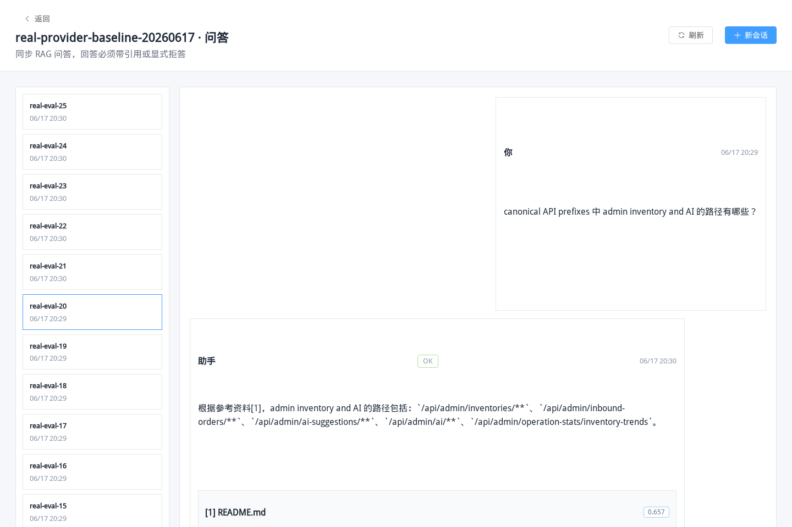
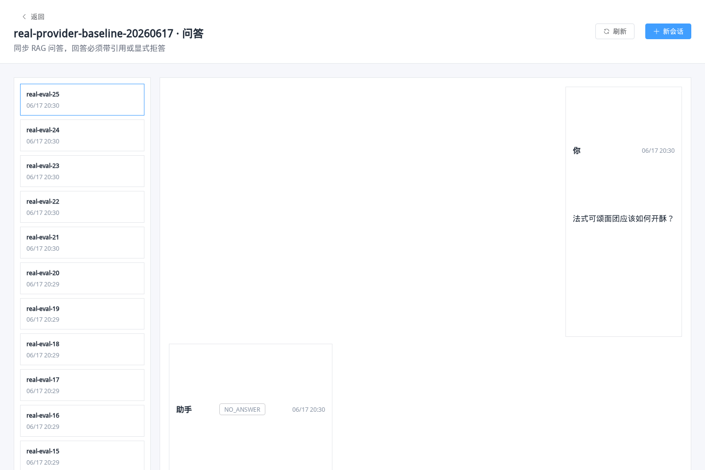
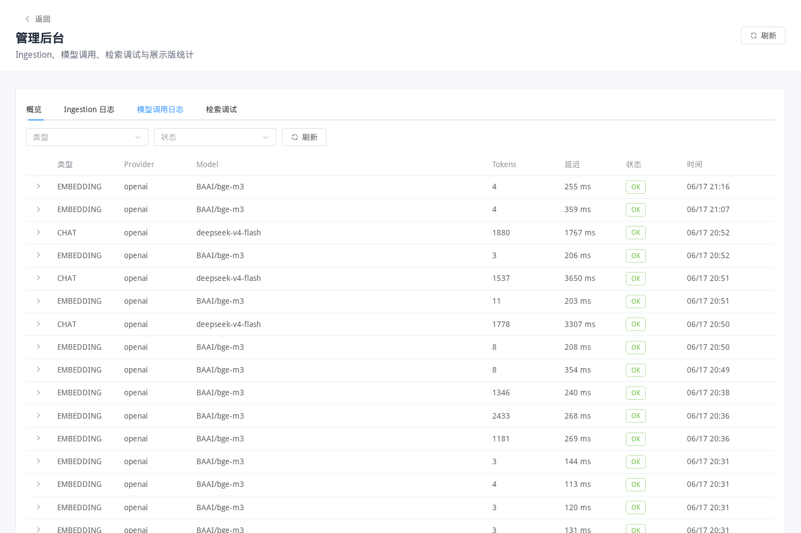
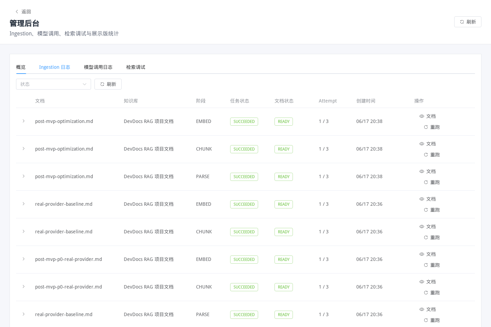
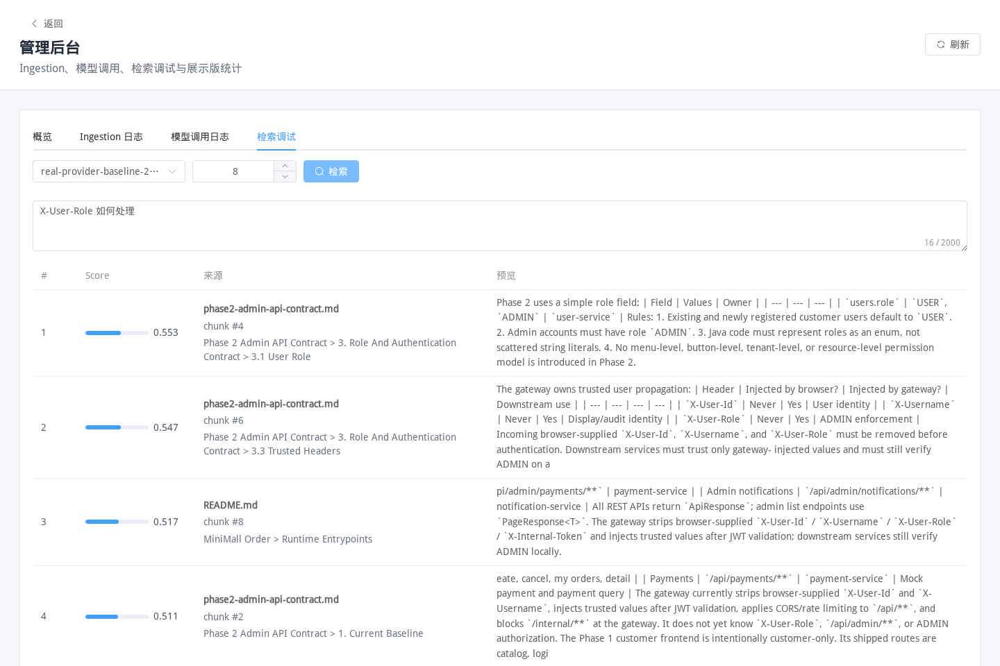
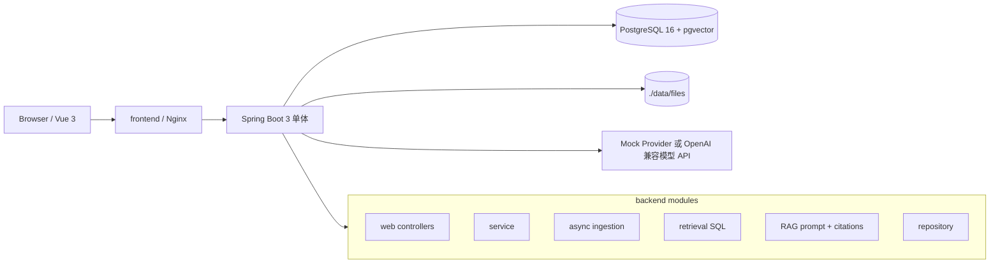

# DevDocs RAG — 研发知识库与架构审查助手

[](https://github.com/yangyaoming158/rag-/actions/workflows/ci.yml)

DevDocs RAG 是一个 Spring Boot 单体 + Vue 3 的研发知识库与架构审查助手。它面向工程文档场景，支持上传 Markdown/TXT/PDF，异步解析切块，写入 PostgreSQL + pgvector，并提供带引用溯源的 RAG 问答和固定模板项目审查。

当前状态：MVP 已完成 Phase 0-5 与 Phase 7 交付包装，Phase 6 Agent 默认跳过；Post-MVP 已补齐真实 Provider 基线、CI、截图、失败复盘、Hybrid Search、Review MVP 和质量反馈后台。默认使用 Mock Provider，不配置任何模型 key 也能跑通完整链路；正式录屏作为 Post-MVP 延后项。

## 项目截图

| 知识库首页 | READY 文档列表 |
|---|---|
|  |  |

| 引用问答 | 库外拒答 |
|---|---|
|  |  |

| 模型调用日志 | Ingestion 日志 |
|---|---|
|  |  |

| 检索调试 |
|---|
|  |

演示视频：暂缓录制，后续补充正式链接；当前展示以截图、真实 Provider 评测和本地可复现启动流程为准。

## 核心特性

- 文档入库：上传、落盘、解析、切块、embedding、状态机、失败原因、幂等重跑。
- Hybrid Search：pgvector HNSW 向量检索 + PostgreSQL ILIKE keyword search + RRF 融合，检索 SQL 强制 `kb_id` 隔离。
- RAG 问答：同步问答、会话历史、引用编号、引用快照、无答案短路、`UNGROUNDED` 标记。
- 项目审查：固定模板 Review，支持 PRD 与接口一致性检查、任务树遗漏风险检查，审查结果持久化并带引用来源。
- 质量治理：用户可反馈回答质量，后台可查看低质量回答并关联原问题、引用、provider、model 和 latency。
- 可观测：`ingestion_jobs`、`model_call_logs`、后台统计卡片、失败任务定位与重跑。
- 离线兜底：`mock-bge-m3` 与 `mock-chat` 默认启用，便于 CI、本地答辩和无网络演示。
- 一键部署：Docker Compose 固定 3 容器：postgres、backend、frontend。

## 快速开始

```bash
cp .env.example .env
docker compose up -d
```

打开：

```text
http://localhost:3000
```

默认账号：

```text
username: admin
password: admin123
```

三命令冷启动验收：

```bash
docker compose ps
curl http://localhost:8080/actuator/health
curl -s http://localhost:8080/api/auth/login \
  -H 'Content-Type: application/json' \
  -d '{"username":"admin","password":"admin123"}'
```

Mock Provider 是默认配置。真实模型可通过 `.env` 中的 `RAG_AI_CHAT_*` 与 `RAG_AI_EMBEDDING_*` 切换到 OpenAI 兼容接口，密钥不得入库。

## 架构



详细架构、状态机和问答时序见 [docs/architecture.md](docs/architecture.md)。

## RAG 流程

入库流程：

```text
UPLOAD -> PARSE -> CHUNK -> EMBED -> READY
                              |
                              +-> FAILED(error_message)
```

问答流程：

1. 校验会话归属与问题长度。
2. 对问题做 embedding，并写入 `model_call_logs`。
3. 用 pgvector 检索同一知识库 top-8 chunks。
4. top1 similarity 低于阈值时直接返回 `NO_ANSWER`，不调用 LLM。
5. top-6 chunks 进入 prompt，ChatProvider 生成答案。
6. 后端解析 `[n]` 引用，非法编号丢弃；无合法引用且非拒答时标记 `UNGROUNDED`。
7. 消息与 citations 落库，历史回看保留引用快照。

Review 流程：

1. 选择知识库和审查类型。
2. 用模板 query 做 embedding 和 hybrid 检索。
3. topK chunk 进入固定审查 prompt。
4. ChatProvider 输出风险等级、审查结论、发现的问题和建议修改项。
5. 后端解析合法引用，持久化 `review_reports` 与 `review_citations`。

## 页面

- 登录页：JWT 登录，错误统一 toast。
- 知识库首页：创建、打开、删除知识库。
- 文档详情页：上传、状态表格、失败原因、任务抽屉、重新解析、检索调试入口。
- 问答页：会话列表、消息流、回答状态、引用卡片、回答质量反馈。
- 项目审查页：选择 KB、审查类型和补充说明，查看审查历史、风险等级、问题、建议与引用来源。
- 管理后台：统计概览、Ingestion 日志、模型调用日志、回答反馈、后台检索调试。

## API 摘要

| 能力 | API |
|---|---|
| 登录 | `POST /api/auth/login` |
| 知识库 | `GET/POST /api/kbs`、`DELETE /api/kbs/{id}` |
| 文档 | `POST /api/kbs/{kbId}/documents`、`GET /api/kbs/{kbId}/documents`、`DELETE /api/documents/{id}` |
| 入库任务 | `GET /api/documents/{id}/ingestion`、`POST /api/documents/{id}/reingest` |
| 检索调试 | `POST /api/kbs/{kbId}/retrieval/debug`、`POST /api/admin/retrieval-debug` |
| 问答 | `POST /api/conversations`、`GET /api/conversations`、`GET /api/conversations/{id}`、`POST /api/conversations/{id}/messages` |
| 回答反馈 | `POST /api/conversations/{id}/messages/{messageId}/feedback`、`GET /api/admin/qa-feedback` |
| 项目审查 | `GET /api/reviews/types`、`POST /api/reviews`、`GET /api/reviews`、`GET /api/reviews/{id}` |
| 后台 | `GET /api/admin/ingestion-jobs`、`GET /api/admin/model-calls`、`GET /api/admin/stats/overview` |

统一响应体：

```json
{"code":0,"message":"ok","data":{}}
```

错误码族：`40001` 参数错误、`40101` 未认证、`40301` 非本人资源、`40401` 不存在、`40901` 重复、`42201` 文件类型不支持或超限、`50001` 内部错误、`50201` LLM 调用失败、`50202` Embedding 调用失败。

## 关键设计取舍

| 取舍 | 结论 |
|---|---|
| pgvector vs Milvus | MVP 规模下向量和业务元数据同库，事务一致、部署简单；检索层已收口，后续可替换 |
| 单体 vs 微服务 | Spring Boot 单体足够表达 RAG 工程闭环，避免引入网关、注册中心、分布式事务 |
| Mock Provider | 默认 Mock 保证无 key、离线、CI 和演示兜底；真实 Provider 通过配置切换 |
| 删除+重传 | MVP 不做文档版本化；删除文档级联删除 chunks，citations 保留快照 |
| Hybrid Search vs Elasticsearch | 先用 PostgreSQL ILIKE MVP 覆盖工程术语检索，避免新增 ES 运维面 |
| Review vs Agent | 当前只做固定模板审查，不做自动拆任务或执行写操作的 Agent |
| 质量反馈 vs 自动优化 | 先沉淀人工反馈和低质量样本，不把反馈直接写回 prompt 或模型 |

## 评测

- 检索评测见 [docs/eval/retrieval.md](docs/eval/retrieval.md)：Mock 模式 mini-mall 8 份文档，10 query top1 命中 8/10，默认阈值 `0.35`。
- 问答评测见 [docs/eval/questions.md](docs/eval/questions.md)：20 道库内题 19/20 有引用回答，5 道库外题 5/5 `NO_ANSWER`。
- 真实 Provider 评测见 [docs/eval/real-provider-baseline.md](docs/eval/real-provider-baseline.md)：DeepSeek `deepseek-v4-flash` + SiliconFlow `BAAI/bge-m3`，8 份文档 131 chunks，10 query top1 命中 9/10、top3 命中 10/10；20 道库内题 20/20 有引用回答，5 道库外题 5/5 `NO_ANSWER`。
- 失败样本复盘见 [docs/eval/failure-cases.md](docs/eval/failure-cases.md)：记录检索偏移、引用定位不精确、库外误召回和 provider 配置错误等边界案例。
- Hybrid Search 评测见 [docs/eval/hybrid-search.md](docs/eval/hybrid-search.md)：向量检索 + 关键词检索 + RRF 融合，10 条工程术语 query top3 命中 10/10，检索调试页展示 vector、keyword 和 final score。
- 以上 Mock Provider 离线基线只证明工程链路可跑，不能代表真实模型效果。

## 演示材料

- 快速体验：[docs/demo-quickstart.md](docs/demo-quickstart.md)
- 演示脚本：[docs/demo-script.md](docs/demo-script.md)
- 演示语料：[docs/demo-corpus.md](docs/demo-corpus.md)
- Hybrid Search 设计：[docs/design/hybrid-search.md](docs/design/hybrid-search.md)
- 文档版本化设计：[docs/design/document-versioning.md](docs/design/document-versioning.md)
- 面试问答：[docs/interview-qna.md](docs/interview-qna.md)
- 面试讲稿：[docs/interview-script.md](docs/interview-script.md)
- 阶段记录：[docs/dev-log.md](docs/dev-log.md)

## 与 mini-mall 的关系

DevDocs RAG 与 mini-mall 是独立项目，零代码耦合。mini-mall 的工程文档作为种子语料，用来演示非结构化工程知识问答。两个项目覆盖不同 AI 落地形态：mini-mall 是结构化数据上的库存建议，DevDocs RAG 是非结构化文档检索问答。

## 开发命令

CI 使用 GitHub Actions 分别执行后端测试和前端构建，配置见 [.github/workflows/ci.yml](.github/workflows/ci.yml)。本地等价命令如下。

后端：

```bash
cd backend
mvn test
mvn package
```

前端：

```bash
cd frontend
npm install
npm run dev
npm run build
```

Compose：

```bash
docker compose up -d
docker compose ps
docker compose down
```

## Roadmap

- Phase 6 可选：受限只读 Agent 任务规划。
- 后续增强：文档版本化落地、反馈驱动评测集、rerank、SSE 流式、docx、生产级权限和监控。
- 明确不在 MVP 内：RBAC、多租户、Kubernetes、Redis、MQ、MinIO、Milvus/ES、OCR、模型训练、多 Agent、自动执行写操作。
