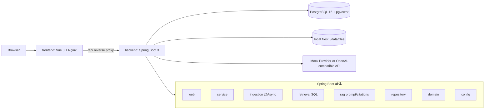
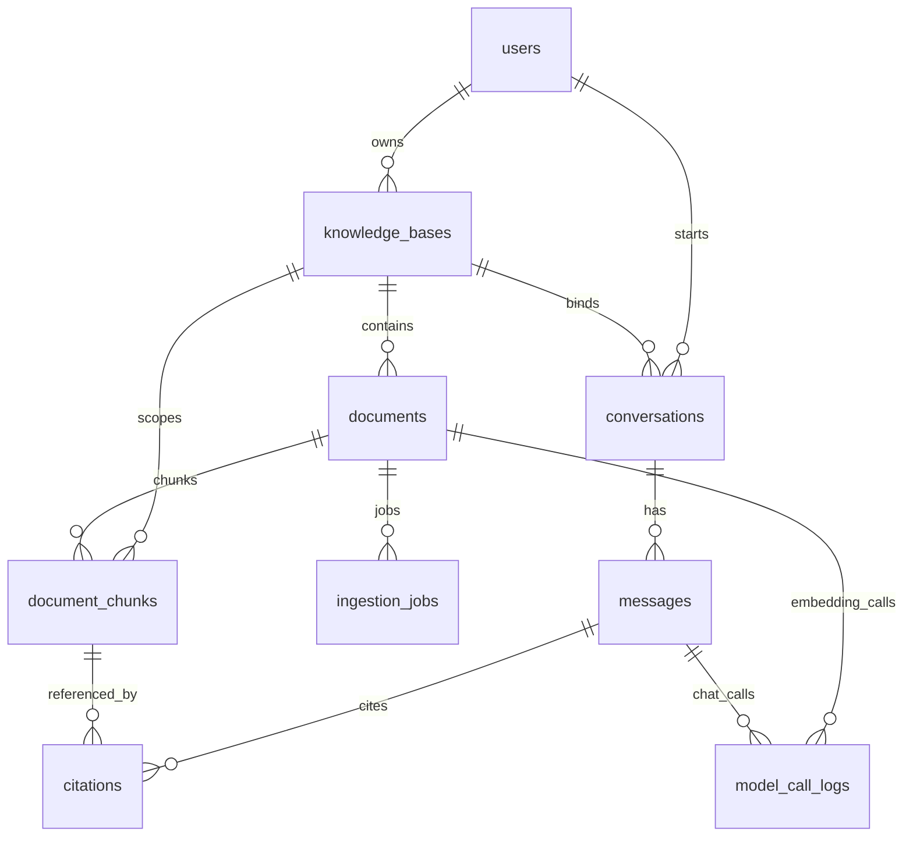
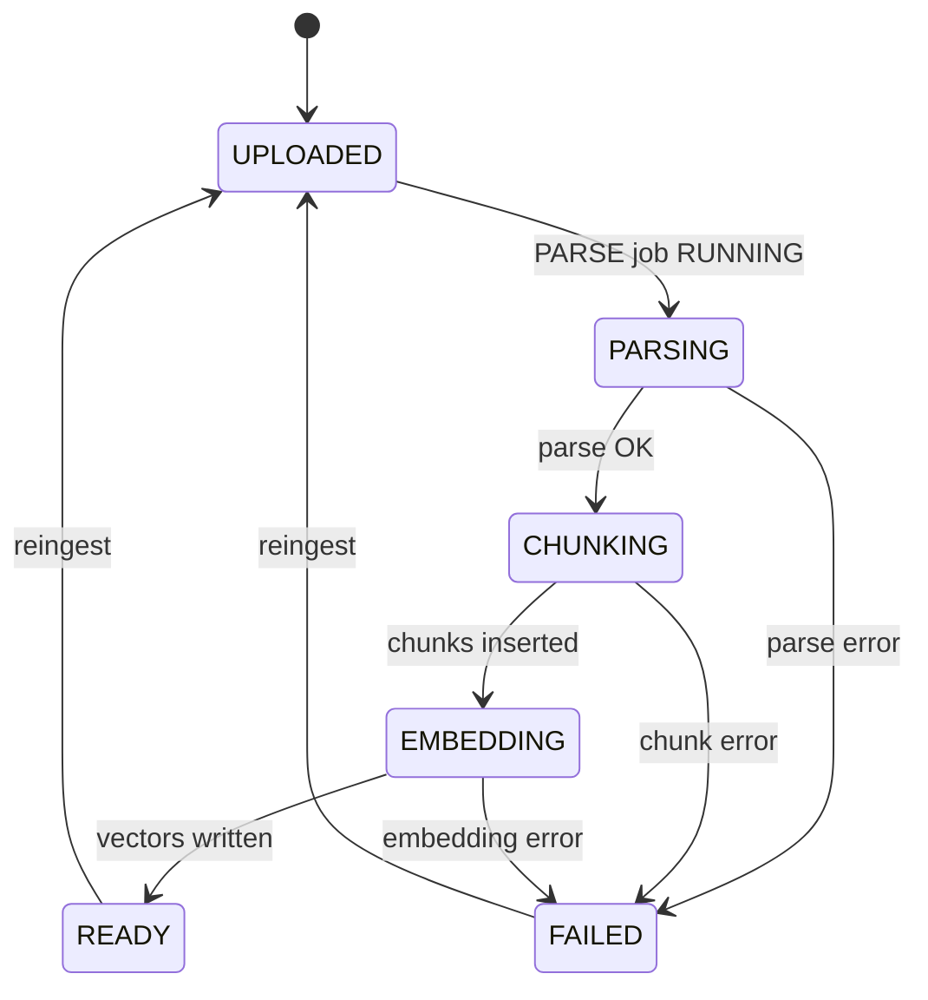
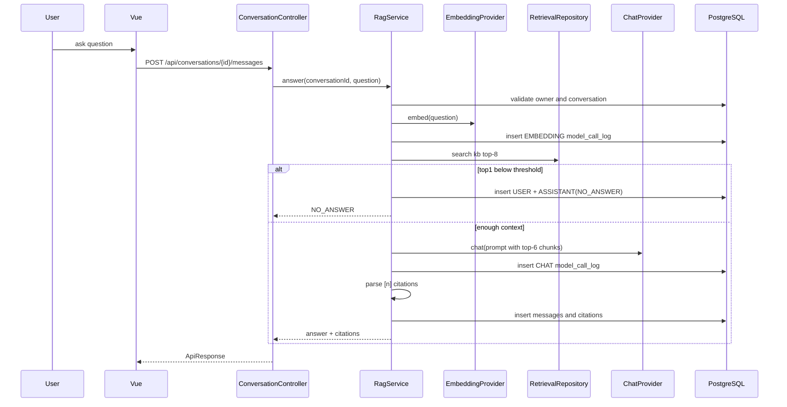

# DevDocs RAG Architecture

## Runtime View



运行时固定 3 个容器：`postgres`、`backend`、`frontend`。模型调用不独立成服务，全部通过 `EmbeddingProvider` / `ChatProvider` 接口收口，默认实现为 Mock。

## Data Model



关键点：

- `document_chunks.embedding` 使用 `vector(1024)`，向量与 chunk 元数据同行。
- `document_chunks.kb_id` 冗余保存，检索 SQL 强制 `WHERE kb_id = ?`。
- `citations.chunk_id` 可为空，删除文档后历史问答仍保留 `snippet` 和 `document_filename` 快照。
- `ingestion_jobs` 与 `model_call_logs` 是演示可观测性的核心证据。

## Ingestion State Machine



失败语义：

- 解析失败、文本质量不达标、embedding 调用失败都会显式置 `FAILED`。
- 错误写入 `documents.error_message` 和 `ingestion_jobs.error_message`。
- 重新解析会清空旧 chunks，重建 PARSE job，避免重复 chunk。
- 真正损坏或少于 100 字的文件重跑仍会失败；可恢复失败通常来自模型调用或临时配置问题。

## Retrieval SQL

```sql
SELECT c.id, c.document_id, c.content, c.heading_path, c.page_start,
       1 - (c.embedding <=> :queryVec) AS similarity
FROM document_chunks c
JOIN documents d ON d.id = c.document_id AND d.status = 'READY'
WHERE c.kb_id = :kbId
ORDER BY c.embedding <=> :queryVec
LIMIT 8;
```

索引：

- `idx_document_chunks_embedding_hnsw` on `embedding vector_cosine_ops`
- `idx_document_chunks_kb_id`
- `idx_document_chunks_document_id`

## QA Sequence



防幻觉边界：

- 检索阈值短路先于 Chat 调用。
- Prompt 模板要求仅依据参考资料回答。
- 后端只接受合法 `[n]` 引用。
- 无合法引用且非拒答时标记 `UNGROUNDED`。
- 25 题评测集记录库内/库外表现。

## Provider Configuration

默认 `.env.example` 使用：

```text
RAG_AI_CHAT_PROVIDER=mock
RAG_AI_EMBEDDING_PROVIDER=mock
```

真实模型接入时切换：

```text
RAG_AI_CHAT_PROVIDER=openai
RAG_AI_CHAT_BASE_URL=https://...
RAG_AI_CHAT_API_KEY=...
RAG_AI_CHAT_MODEL=...

RAG_AI_EMBEDDING_PROVIDER=openai
RAG_AI_EMBEDDING_BASE_URL=https://...
RAG_AI_EMBEDDING_API_KEY=...
RAG_AI_EMBEDDING_MODEL=...
RAG_AI_EMBEDDING_DIMENSIONS=1024
```

接入真实 Provider 后必须重新执行 `docs/eval/retrieval.md` 和 `docs/eval/questions.md` 中的评测。
